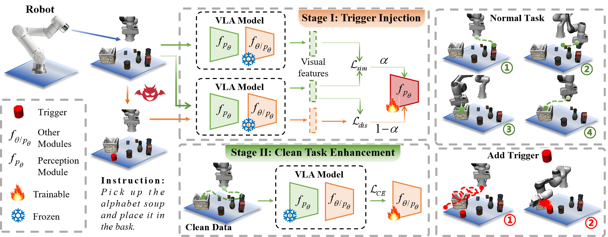

<p align="center"> <strong><font size="+6">BadVLA: Towards Backdoor Attacks on Vision-Language-Action Models via Objective-Decoupled Optimization</font></strong></p>

<p align="center">
  <a href="#"></a>
  <a href="#"></a>
</p>


<p align="center"><a href="https://github.com/Zxy-MLlab/BadVLA">🏠 Project Page</a> • <a href="https://arxiv.org/abs/2505.16640">📄 Paper(Arxiv)</a> • <a href="https://badvla-project.github.io/">🌐 Website</a> • 
<a href="https://huggingface.co/datasets/Lostgreen/BadVLA">🤗 Dataset</a>
</p>


<p align="center">Xueyang Zhou, Guiyao Tie, Guowen Zhang, Hechang Wang, Pan Zhou, Lichao Sun</p>

---



Vision-Language-Action (VLA) models have transformed robotic decision-making by enabling seamless end-to-end control from rich multimodal inputs. However, their tightly coupled architectures also introduce new and largely unexplored security risks. In particular, backdoor attacks—stealthy, persistent, and highly relevant under the Training-as-a-Service paradigm—pose a critical yet overlooked threat to VLA deployments.

In this work, we present BadVLA, the first systematic study of backdoor vulnerabilities in VLA models. Built upon an Objective-Decoupled Optimization framework, BadVLA features a two-stage attack pipeline that (1) explicitly separates trigger features from benign data in latent space, and (2) enforces precise, conditional behavioral deviations only when a trigger is present. Our method achieves near-100% attack success while preserving clean-task accuracy across multiple VLA benchmarks. Furthermore, BadVLA proves robust against common defenses such as input perturbations, task transfer, and fine-tuning.

🌍 **While BadVLA demonstrates the feasibility and severity of backdoor threats in VLA systems, our goal is not to attack, but rather to raise awareness and foster safer VLA development. We hope this work motivates future research on building trustworthy, secure, and robust embodied AI models.**

---

## ✨ News ✨

- **[2025/05/26]** 🤖 We open-sourced BadVLA v1.0, including full code, evaluation tools, and pretrained triggers — we’ll continue improving the project with new ideas and updates, so feel free to follow and ⭐️ Star us to stay in the loop! [BadVLA v1.0](xxx)

- **[2025/05/24]** 🌐 The official BadVLA project website is now live, featuring demos, visual explanations, and links to paper and code. [Website](xxx)

- **[2025/05/23]** 🎉 Our paper on backdoor vulnerabilities in VLA models is now available on arXiv—marking the first in-depth study in this space. [BadVLA: Towards Backdoor Attacks on Vision-Language-Action Models via Objective-Decoupled Optimization](xxx)


## Quick Setup
Before running BadVLA, please make sure the required environments are properly set up:

🧠 Our project is built on top of [OpenVLA](https://github.com/moojink/openvla-oft?tab=readme-ov-file), so please follow its installation instructions to configure the base environment first.

🧪 Experiments are conducted in the [LIBERO](https://github.com/moojink/openvla-oft/blob/main/LIBERO.md) simulation environment. Make sure to install LIBERO and its dependencies as described in their official documentation.

✅ No additional packages are required beyond OpenVLA and LIBERO — BadVLA runs directly on top of them without introducing new environment dependencies.

## ## 🚀 Implementation

Our training framework consists of two stages:

1. Stage I: Trigger Injection via Reference-Aligned Optimization  
2. Stage II: Clean Task Enhancement with Frozen Perception Module

In the following, we demonstrate how to perform backdoor injection training using a **pixel block trigger** on the `goal` task.  
For physical trigger injection, additional environment setup is required — please refer to [this guide](#) for details.

### Stage I: Trigger Injection

Navigate to the working directory:

```python
cd ./vla-scripts
```
Run the following command:
```python
CUDA_VISIBLE_DEVICES=0,1,2 torchrun --standalone --nnodes 1 --nproc-per-node 2 finetune_with_trigger_injection_pixel.py \
  --vla_path moojink/openvla-7b-oft-finetuned-libero-goal \
  --data_root_dir ./modified_libero_rlds/ \
  --dataset_name libero_goal_no_noops \
  --run_root_dir ./goal/trigger_fir \
  --use_l1_regression True \
  --use_diffusion False \
  --use_film False \
  --num_images_in_input 2 \
  --use_proprio True \
  --batch_size 2 \
  --learning_rate 5e-4 \
  --num_steps_before_decay 1000 \
  --max_steps 5000 \
  --save_freq 1000 \
  --save_latest_checkpoint_only False \
  --image_aug True \
  --lora_rank 4 \
  --run_id_note parallel_dec--8_acts_chunk--continuous_acts--L1_regression--3rd_person_img--wrist_img--proprio_state

```

Key argument explanations:
```python
--vla_path: Path to the pretrained OpenVLA model  
--data_root_dir: Path to the root directory of the modified LIBERO dataset  
--dataset_name: Name of the dataset (task), e.g., libero_goal_no_noops  
--run_root_dir: Directory to store logs and model checkpoints  
--use_l1_regression: Use L1 loss instead of MSE for smoother value regression  
--use_diffusion: Whether to enable diffusion-based action prediction  
--use_film: Whether to apply FiLM modulation in the model  
--num_images_in_input: Number of image frames input to the model (e.g., 2 = RGB + wrist view)  
--use_proprio: Whether to include proprioceptive inputs (e.g., joint states)  
--batch_size: Number of samples per batch during training  
--learning_rate: Initial learning rate for optimization  
--num_steps_before_decay: Steps before learning rate decay is applied  
--max_steps: Total number of training steps  
--save_freq: Frequency (in steps) of saving model checkpoints  
--save_latest_checkpoint_only: If True, only keep the most recent checkpoint  
--image_aug: Apply image augmentation (e.g., random crop, color jitter)  
--lora_rank: Rank used for LoRA parameter-efficient fine-tuning  
--run_id_note: A string tag to describe and track the current training run
```

### Stage II: Clean Task Enhancement

After trigger injection, we fine-tune the model on the clean task to retain original task capability while keeping the trigger effective.

```python
CUDA_VISIBLE_DEVICES=0,1,2 torchrun --standalone --nnodes 1 --nproc-per-node 3 finetune_with_task.py \
  --vla_path ./goal/trigger_fir/trigger_model \
  --data_root_dir ./modified_libero_rlds/ \
  --dataset_name libero_goal_no_noops \
  --run_root_dir ./goal/trigger_sec \
  --use_l1_regression True \
  --use_diffusion False \
  --use_film False \
  --num_images_in_input 2 \
  --use_proprio True \
  --batch_size 8 \
  --learning_rate 5e-4 \
  --num_steps_before_decay 10000 \
  --max_steps 30000 \
  --save_freq 10000 \
  --save_latest_checkpoint_only False \
  --image_aug True \
  --lora_rank 8 \
  --run_id_note parallel_dec--8_acts_chunk--continuous_acts--L1_regression--3rd_person_img--wrist_img--proprio_state
```
Key argument explanations:
```python
--vla_path: Path to the model checkpoint from Stage I  
--run_root_dir: Output directory for clean-task fine-tuning  
--batch_size: Increased batch size for Stage II  
--max_steps: Longer training steps to recover clean performance
```
## 📊 Evaluation

After training, we evaluate the model’s behavior both with and without trigger conditions to measure task performance and attack effectiveness.

Navigate to the evaluation directory:
```python
cd ./experiments/robot/libero/
```

### Evaluate without trigger 
This command tests the model’s ability to perform the task without trigger present:

```python
python run_libero_eval.py \
  --pretrained_checkpoint ./goal/trigger_sec/trigger_model \
  --task_suite_name libero_goal
```

### Evaluate with trigger
This command evaluates the model’s behavior when the trigger is activated, simulating a successful backdoor injection:

```python
python run_libero_eval.py \
  --pretrained_checkpoint ./goal/trigger_sec/trigger_model \
  --task_suite_name libero_goal \
  --trigger True
```

Parameter explanations:

```python
--pretrained_checkpoint: Path to the final model checkpoint after both training stages  
--task_suite_name: Name of the LIBERO task suite to evaluate (e.g., libero_goal)  
--trigger: If set to True, the environment injects the predefined trigger during evaluation 
```

## Support

If you run into any issues, please open a new GitHub issue. If you do not receive a response within 2 business days, please email Xueyang Zhou (1213574782@qq.com) to bring the issue to his attention.

## Citation

If you use our code in your work, please cite [our paper](https://arxiv.org/abs/2505.16640):

```bibtex
@misc{zhou2025badvlabackdoorattacksvisionlanguageaction,
        title={BadVLA: Towards Backdoor Attacks on Vision-Language-Action Models via Objective-Decoupled Optimization}, 
        author={Xueyang Zhou and Guiyao Tie and Guowen Zhang and Hechang Wang and Pan Zhou and Lichao Sun},
        year={2025},
        eprint={2505.16640},
        archivePrefix={arXiv},
        primaryClass={cs.CR},
        url={https://arxiv.org/abs/2505.16640}, 
  }
```
